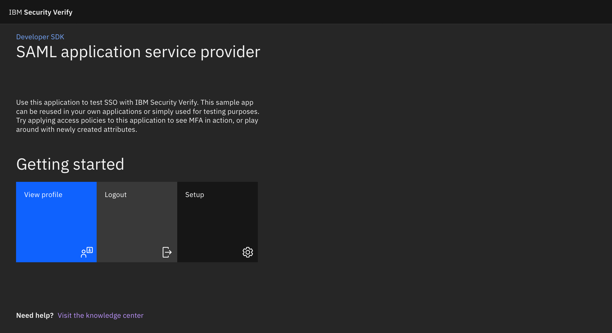
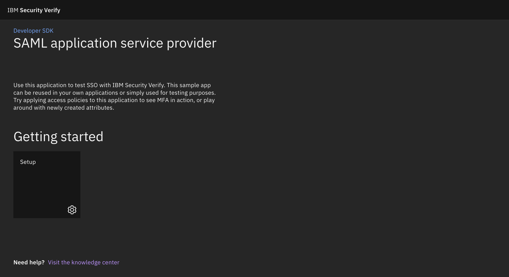
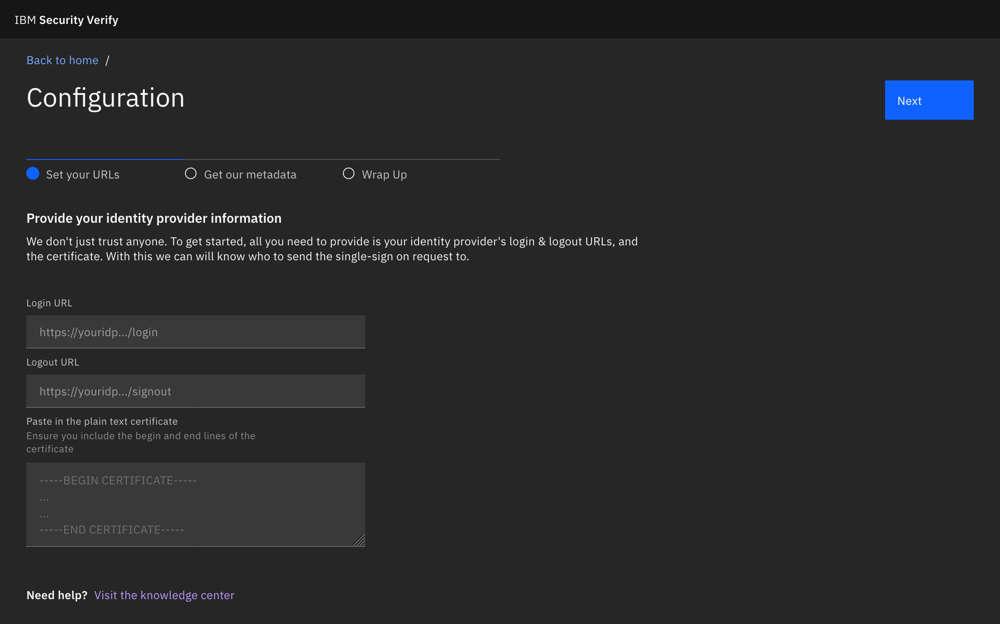
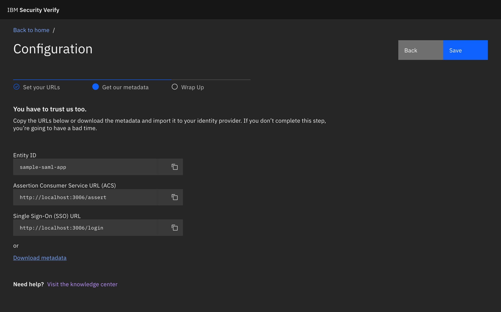
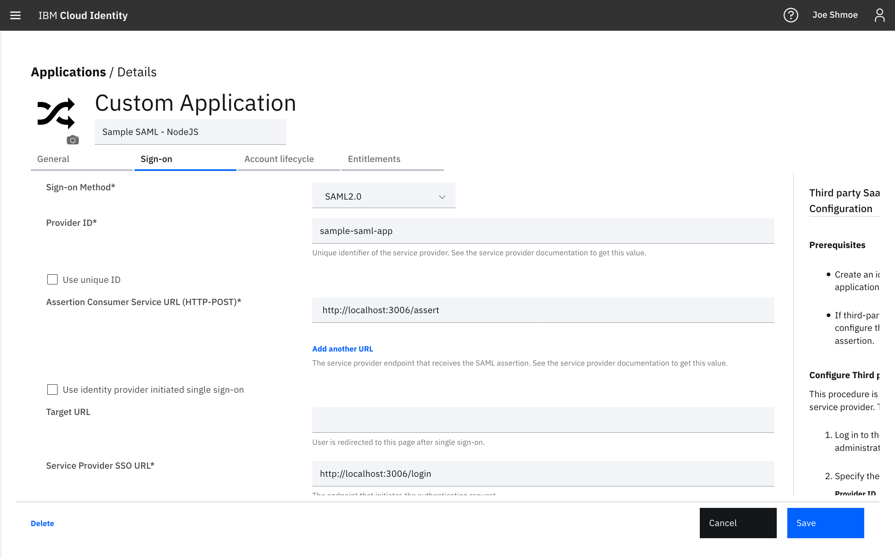
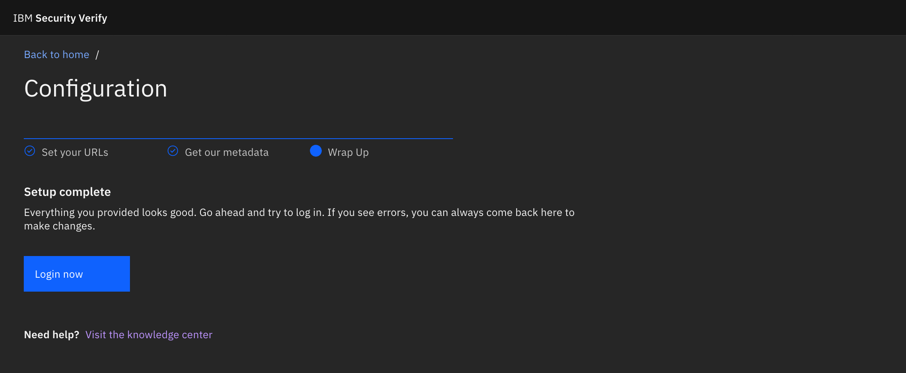
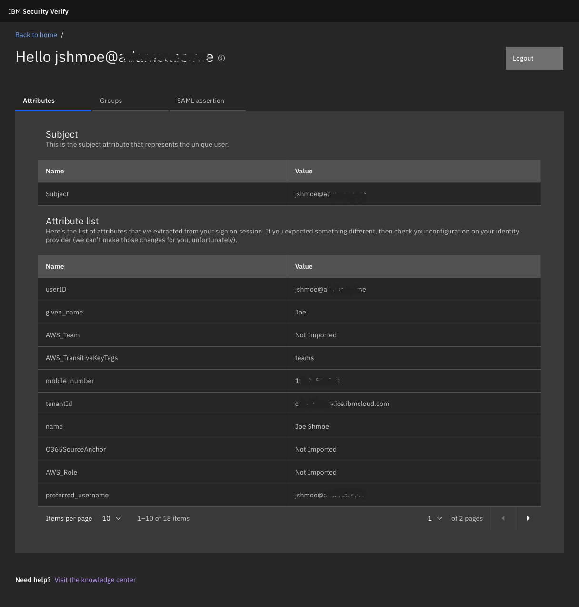

# Table of Contents
<!-- TOC -->

- [Table of Contents](#table-of-contents)
- [Introduction](#introduction)
    - [Developer Utilities / Sample SAML application](#developer-utilities--sample-saml-application)
    - [Getting started](#getting-started)
        - [Pre-requisites](#pre-requisites)
- [Application setup](#application-setup)
    - [Perform setup](#perform-setup)
    - [Install packages](#install-packages)
        - [Additional setup parameters (optional)](#additional-setup-parameters-optional)
    - [Start the application](#start-the-application)
    - [Configure the SAML settings](#configure-the-saml-settings)
        - [Create an application in Cloud Identity](#create-an-application-in-cloud-identity)
        - [Get service provider settings](#get-service-provider-settings)
        - [Login now](#login-now)
    - [View profile](#view-profile)

<!-- /TOC -->

# Introduction

## Developer Utilities / Sample SAML application

This application can be used for development or demonstration purposes with any SAML identity provider. When a login attempt is successful, you will be able to view the name identitifier, all attributes, and groups that were received. Additionally, we provide the raw SAML assertion for more advanced debugging. 



## Getting started

You will do all the configuration of the application through the UI so there is no need to configure anything before hand.

### Pre-requisites

1. You will need an IBM Security Cloud Identity tenant or another Identity Provider that supports SAML. 
2. To run locally, you will need to install [NodeJS](https://nodejs.org/en/download/) and [Yarn](https://www.npmjs.com/package/yarn). 
    - Install yarn by running `npm i yarn` in your terminal window. 
    - **Note:** You will only need Yarn in case you want to modify the application, otherwise, node is all that is necessary.
3. It's import to clone this repo to keep it in sync, otherwise you can simply download the zip file from GitHub.

# Application setup

## Perform setup

In the directory where you want the repo clone directory to be created, run this command:

```
git clone https://github.com/ajcase/CI-SAML-Sample
```

## Install packages

Go into the `CI-SAML-Sample` directory and install required packages:

```js
cd CI-SAML-Sample
npm install
```

### Additional setup parameters (optional)

The .env file is already created for you. However, in case you want to modify the paramters for production hosting then you can modify the URL, port, and entity ID for the SAML service provider configuration.

Edit the .env file and complete to your needs:

```js
SASS_PATH="node_modules"
SKIP_PREFLIGHT_CHECK=true
REACT_APP_HOSTNAME=http://localhost:3006
REACT_APP_ENTITYID=sample-saml-app
PORT=3006
```

Save the file and close the editor.

## Start the application

Start the application by running the command: 

```js
yarn start
```

Navigate to the http://localhost:3006 to begin



## Configure the SAML settings

You will need to exchange information between your identity provider and the application. 

Click the Setup tile to get started.

### Create an application in Cloud Identity

In Cloud Identity, create a new custom application. 

On the General tab:

1. Set the `Company name` to `Sample App`

On the Sign on tab:

1. Choose `SAML2.0`
2. On the right side instructions, copy the following parameters from the **Configure Third party SaaS application as the service provider (SP)** section.
    - **Login URL**
       
        ex. `https://tenant.ice.ibmcloud.com/saml/sps/saml20ip/saml20/login`
    - **Logout URL**
        
        ex. `https://casesecurity.ice.ibmcloud.com/idaas/mtfim/sps/idaas/logout`
    - **Signing certificate**
        
        ex. 
            -----BEGIN CERTIFICATE-----
            MIIDOjCCAiKgAwIBAgIEfA/06DANBgkqhkiG9w0BAQsFADBfMQkwBwYDVQQGEwAx
            CTAHBgNVBAgTADEJMAcGA1UEBxMAMQkwBwYDVQQKEwAxCTAHBgNVBAsTADEmMCQG
            A1UEAxMdY2FzZXNlY3VyaXR5LmljZS5pYm1jbG91ZC5jb20wHhcNMTgwNzA3MTc1
            MTU5WhcNMjgwNzA0MTc1MTU5WjBfMQkwBwYDVQQGEwAxCTAHBgNVBAgTADEJMAcG
            A1UEBxMAMQkwBwYDVQQKEwAxCTAHBgNVBAsTADEmMCQGA1UEAxMdY2FzZXNlY3Vy
            aXR5LmljZS5pYm1jbG91ZC5jb20wggEiMA0GCSqGSIb3DQEBAQUAA4IBDwAwggEK
            AoIBAQDC2K9xO1IAzk/Jm/Kj9sIvxPDQi0JzHhwBa/Scn71sey8BQId9URAIy6ps
            RKFe6kATznWiBMsDq5dMgimxUUYq5g6/73KYjp45AxQOUe1bd1OgS9YH26bCedpz
            ZMZ8c0xVXmyDkpn+2I/KHhqQ5uUugTmZA1po6yQEPauQvgP8zCUOQe2x3enGT6us
            Hr8pRa0GMnwvgQpoTg8G8xISeVxLxSOG7YhzDDs80Sf7XTh2Ow+ZYJ9eHnQk/5PC
            7+Qn5bpqRnsy2eGhfq0lqED/k3mJnbX1GmrBD+yKgrNMZCZE2JUXRv15bqoebnAg
            s2lOXUYpAMVfK9d5GtpG9BxTLvSLAgMBAAEwDQYJKoZIhvcNAQELBQADggEBAEzw
            V120BI3QC4LBUMtrEXpTjqyBF/XwYk4o0hdJpC66JG98slaIa0CsJaCl0aNlvwUz
            tA8FlbiZX2V/cqhN+N+faXq5+LuTzE6ngwheMt8XiGy93Soa2AyrfZQb1nfN27bL
            l9/5krCG6AuhJVddlElvFmE9yMYPGjMNlpdDwnzpktrhn798ZTv4vGXufg344O8h
            Y+NhoW6kefGTLvko4LaRLHlxJJQSkYfF4yAC02xsy33m5lX1hPt7StRAhI3WA7ow
            KXM4ZdeJLQBRdiC33OLDFO2lYH44LKfZcqg9tNVz8ByLB6coY6SdIFihtkdAGUyX
            4qigEuvcHF+HX7jxWDM=
            -----END CERTIFICATE-----
3. Provide these parameters to the input boxes provided in the first step. Click **Next** when all paramters have been entered.


### Get service provider settings

This page contains the few paramters needed to provide to your identity provider. Provide each of these into the corresponding fields within your identity provider. 



1. Copy the **Entity ID** (otherwise known as Provider ID in some Identity Providers)
    
    ex. `sample-saml-app`
2. Copy the **Assertion Consumer Service URL (ACS)**

    ex. `http://localhost:3006/assert`
3. Copy the **Single Sign-On (SSO) URL**
    
    ex. `http://localhost:3006/login`

or

1. Download the metadata for import into your identity provider (if it supports this method)

**(Optional)** Advanced settings that may be necessary, but not for IBM Cloud Identity:

- Allow unencrypted session: `true`
- Name ID Format: `urn:oasis:names:tc:SAML:1.1:nameid-format:emailAddress`
- Force Authn: `true`
- Authentication Method: `urn:oasis:names:tc:SAML:1.0:am:password`

**Example IBM Cloud Identity Configuration**


### Login now

After saving the configuration, you'll be able to test the login flow. When clicking on the login button, an SP-intiated login request will occur.



## View profile

Upon a successful login, you will now see a "View Profile" option on the homepage. Click this to view the full profile, groups, and raw SAML assertion.


